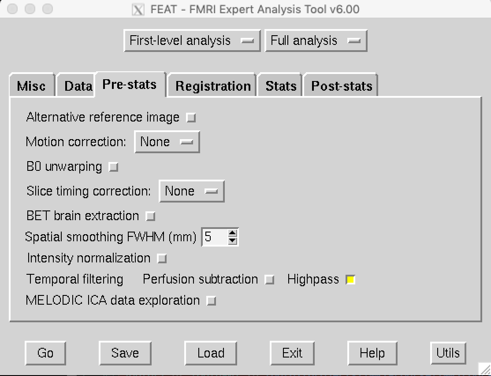

```{r setup, include=FALSE}
knitr::opts_chunk$set(echo = T,eval=FALSE,tidy=T,fig.keep="all")
library(reticulate)
use_python("/usr/bin/python")
```

# To start
## Working with Linux
Linux is an open source operating system commonly used by scientists. MRIQC, FMRIPREP and FSL, that are the softwares we will use for fMRI analysis in this tutorial, run all on Linux, or on an OS operating system. For these reasons this tutorial is based on Linux. The drawback of Linux is that most students have no experience with this operating system. Therefore we start with a small introduction.

## Getting Started
The recordings have been placed for you in **/data1/projects/fMRI-course/[name of your group]** on the server we will be working from. You will work from this folder and get a glimpse in the analysis of fMRI data using *BIDS*, *MRIQC*, *FMRIPREP* and *FSL*. Please log in onto the Spinoza server using your own credentials ("student01" to "student20") and the common password (please ask us). Linux programs can be started via a link (for instance via the links on the desktop or under the 'Applications' button), or via the console window. This console window is similar to the windows Command Prompt or MAC OSX Terminal. The console window is also called Terminal depending on the Linux flavor. 

## Working directory & Connect to *compute-01*

Please open a new terminal window 

> *Applications >> System Tools >> Terminal*

First, using this command, connect to the computation node of the Spinoza centre ("compute-01"):

```{bash}
ssh -Y compute-01
```

Second, load the necessary modules with the following lines:

```{bash}
module load collections/default
```

# BIDS format
This tutorial is here help you to convert your data in the BIDS format, in order to later give you the possibility to use BIDS Apps (MRIQC and FRMIPREP).

## The BIDS data structure
Your scanning sessions have been exported with the extensions .PAR and .REC. In this section we will first convert these files to NIFTI, organize them in accordance with the BIDS guidelines, verify the validity of our formating, and finally inspect the data using FSLeyes.


### Convert files from PAR/REC to nifti
 
  + use the cd command to change your directory to the converter function *convert2niigz.py*
	
```{bash}
cd /data1/projects/fMRI-course/Spinoza_Course/BIDS/
```
  
  + convert your data to nii.gz format using "dcm2niix" (recommanded option)

```{bash}  
python convert2niigz.py [path to your raw_data folder] dcm2niix
# e.g. convert2niigz.py /data1/projects/my_projet_raw_folder/ dcm2niix
```

  + as an alternative use "parrec2nii" (it might create errors in TR timing)
	
```{bash}  
python convert2niigz.py [path to your raw_data folder] parrec2nii
# e.g. convert2niigz.py /data1/projects/my_projet_raw_folder/ dcm2niix
```

### Organize the files in accordance with the BIDS format

 + use the cd command to change your directory towards the converter function *bids_generator.py*
	
```{bash}
cd /data1/projects/fMRI-Course/Spinoza_Course/BIDS/
```
		
  + generate a BIDS dataset with this command:

```{bash}  
python bids_generator.py [raw data path] [BIDS data path] [subject name] [task name]
# e.g. python bids_generator /data1/projects/fMRI-Course/proj-01/raw_data/ /data1/projects/fMRI-Course/proj-01/bids_data/ sub-001 MyTask
```

### Create the JSON files

 + *dataset_description.json*

This first json file should be put in the BIDS root directory and should contain basic information about the dataset. Note that you can put all the information you would like here, such as the task instructions.
 
```{json}  
{"Name": "MyTask task blablabla in 3T scanner",
"BIDSVersion":  "1.1.1",
"Authors": ["Sara Jahfari, Martin Szinte"]}
```
 + *task-MyTask_bold.json*

This second file should also be put in the BIDS root directory and should contain  information the scanning session. These information can be obtained from your scanning assistant/physicist, read within the .par files of the raw data or computed (see below). We here present the information strictly necessary, more information can be reported here. Refer to http://bids.neuroimaging.io and to the BIDS specification file (http://bids.neuroimaging.io/bids_spec.pdf) for details.

```{json}
{"RepetitionTime": 0.700,
"EchoTime": 0.030,
"EpiFactor": 53,
"WaterFatShift": 14.042,
"PhaseEncodingDirection": "j",
"SenseFactor": 4,
"SliceDirection": "z",
"MultiBandFactor": 4,
"EchoTimeDifference":0.00253,
"EffectiveEchoSpacing": 0.00015193,
"SliceTiming": [0.0,0.0636,0.1273,0.1909,0.2545,0.3182,0.3818,0.4455,0.5091,0.5727,0.6364,0.0,0.0636,0.1273,0.1909,0.2545,0.3182,0.3818,0.4455,0.5091,0.5727,0.6364,0.0,0.0636,0.1273,0.1909,0.2545,0.3182,0.3818,0.4455,0.5091,0.5727,0.6364,0.0,0.0636,0.1273,0.1909,0.2545,0.3182,0.3818,0.4455,0.5091,0.5727,0.6364],
"SliceOrder": "ascending",
"TaskName": "MyTask"}
```

### Read in .PAR file of bold scan file:
  
>"RepetitionTime" >>  "Repetition time [ms]" convert this data from ms to seconds
 
>"EchoTime" >> IMAGE INFORMATION TABLE column "echo", be careful convert the value in second
  
>"EpiFactor" >> "EPI factor"
 
>"WaterFatShift" >> Water Fat shift [pixels]
 
>"TaskName" >> pick the name you used for the bids generator
 
### Read in .PAR file of B0 scan file:
 
>"EchoTimeDifference": >> IMAGE INFORMATION TABLE column "echo", be careful convert the value in second
  
### Ask your scanning assistant / physicist:

>"PhaseEncodingDirection" => most of the time it is "j"
 
>"SliceDirection" => most of the time it is "z"
 
>"MultiBandFactor"
 
>"SliceOrder" => most of the time it is "ascending"

### Compute values yourself
 
>"EffectiveEchoSpacing" >> edit with your scan information "calc_echo_spacing_philips_mod.py" (in SUBLIME TEXT or TextEdit for example) and obtain the correct value.

```{bash}  
# cd to the Spinoza_Course/BIDS/
python calc_echo_spacing_philips_mod.py
# the information will be printed in the terminal
```

>"SliceTiming" >> edit "calc_slice_timing.py" with your scan information and obtain the correct values (be carefull to edit the results to match the example above). Note that if this informtion is not given, FMRIPREP will not apply any slice timing correction.

```{bash}  
# cd to the Spinoza_Course/BIDS/
python calc_echo_spacing_philips_mod.py
# the information will be printed in the terminal, edit them to have comma between each value and replace any "." by ".0" (e.g. 0. should be written 0.0)
```
 
 + *fmap/sub-00X_phasediff.json*

This third file should be put in the /fmap folder of each subject and should contain information about the B0 field map scans to apply to the bold sessions. Information can be read within the .par files or computed.

```{json}
{"EchoTime1": 0.030,
"EchoTime2": 0.03253,
"IntendedFor": ["func/sub-00X_task-MyTask_run-1_bold.nii.gz","func/sub-00X_task-MyTask_run-2_bold.nii.gz"]}
```

>"EchoTime1" >> same as "EchoTime" of *task-MyTask_bold.json*

>"EchoTime2" >> sum of "EchoTime" and "EchoTimeDifference" of *task-MyTask_bold.json*

>"IntendedFor" >> list the path of bold sequence for which this field map should be apply

### Make event files (optional)

We could then convert the timing files from the scanner such that we know when each event occurred across the scan, and what the duration was (i.e., Go trial correct, Go trial incorrect, Stop trial successful, Stop trial failed, omission, etc.). For example, in a stop task, an event starts when the go stimulus is presented, and the duration is defined as the total time that the picture was on screen.

+ cd back to the directory with all the git codes, and open R (just type R into terminal). The enter the following code. Make sure to fill in the path where you saved the raw input from the scanner. 

```{bash}
cd /data1/projects/fMRI-course/Spinoza_Course/BIDS
```

- now type R into terminal and press enter

```{r}
source('Generateevents_tsv_stopsignal.R')
datadir = "/data1/projects/fMRI-course/[your folder]/raw_data/3T/behavior"
outputdir="/data1/projects/fMRI-course/[your folder]/bids_data/3T/sub-001/func"
bidsname='sub-001'

# this function creates an events.tsv file in the bids_data/xx/xx/func folder
Make_stopevents(datadir,bidsname,outputdir)
q() # this is to quit R, say n for savin workspace

# open the .tsv file with a text program to see what just happend
```

### Check the validity of your BIDS dataset

Using a web validator ("https://bids-standard.github.io/bids-validator/") verify that your dataset is valid. Note that your dataset can stay with "warnings" but not with "errors". Correct the errors as a function of the description given on the website to obtain a validaded dataset. Only then you can go to the next step.

### Inspect Raw images with FSL
FSLeyes allows you to visually inspect most types of MRI images. Before you start your inspection, a few short notes on what you will be seeing on screen. Each selected image will be opened in an orthogonal view; coronal, sagittal and axial views are displayed simultaneously. If there is sufficient information present in the image header, L, R, A, P, S, I (Left, Right, Anterior=front, Posterior=back, Superior=top, Inferior=bottom) orientation markers will be displayed, making the orientation clear. 

1. To inspect images, first in your terminal type:
```{bash}
module load fsl
fsleyes
```

2. To open an image, select the 'add from file' from the File menu. A file opening dialog will appear. Now browse to the directory where you just stored the BIDS files and start inspecting them.

3. To inspect the anatomical scan select the _T1w.nii.gz file from the anat folder. FSLeyes will now load the recorded structural scan. Click on one of the brains with your mouse, and hold down the button to navigate across the whole brain.

4. Just to give you an intuition in how the epi or fMRI scan (lot’s of very fast brain recordings) differs from the structural (MRI) scan we would now like you to open the _bold.nii.gz scan in the func folder. Notice how the quality of this image is much lower. This is because with fMRI a lot of brain images are recorded with only a short time between them, which makes the quality of the image go down. You can click on the movie icon to quickly go over all images.

Now to get an idea of the raw time series. First, make sure to click on a voxel, and then do the following:

> "View >> Time series" 

Structural MRI scans improve the process of normalizing the fMRI scan to a standard space. This step is important because you want to report, in the end, on the activation at the group level (referring to the entire group). The brain of individual subjects differ substantially from each other and therefore the fMRI scans (epi) need to be normalized towards a common space for all participants. We will now turn, to the preprocessing of data using FMRIPREP.

# MRIQC

To quickly check the validity of your BIDS dataset and to determine the quality of your scan (T1w or EPI), you can run MRIQC. 

To run MRIQC, use the following command:

```{bash}
# TYPE THIS AGAIN, if the terminal session was closed
# ---------------------------------------------------
# ssh -Y compute-01  
# module load collections/default

cd /data1/projects/fMRI-Course/Spinoza_Course/MRIQC/
python mriqc_tmux.py [main directory] [bids directory] [deriv directory] [temp directory] 
					 [subject] [processessors] [your id]
					 
# e.g. python mriqc_tmux.py data1 /data1/my_bids_data/ /data1/my_deriv_data/ /data1 my_temp_data/ sub-001 8 student01
```

The software will be run on a tmux (terminal multiplexer) and will take about an hour.
Please, refer to the course of Tuesday for some details about the output of MRIQC.

# FMRIPREP

Now that we have organized the files in BIDS format, we can start to preproces the data using FMRIPREP.

To run FMRIPREP, use the following command:

```{bash}
# TYPE THIS AGAIN, if the terminal session was closed
# ---------------------------------------------------
# ssh -Y compute-01  
# module load collections/default

cd /data1/projects/fMRI-Course/Spinoza_Course/FRMIPREP/
python fmriprep_tmux.py [main directory] [bids directory] [deriv directory] [temp directory]
						[subject] [processessors] [your id]
# e.g. python mriqc_tmux.py data1 /data1/my_bids_data/ /data1/my_deriv_data/ /data1 my_temp_data/ sub-001 8 student01
```
The software will be run on a tmux (terminal multiplexer) and will take about 10h to 12h to run.
Please, refer to the course of Tuesday for some details about the output of FMRIPREP.

Now that we have organized the files in BIDS format, we can start running the preprocessing with FMRIPREP.

## Inspecting the output

1. log into your tmux session again to check if the preprocessing is done.
```{bash}
tmux ls
tmux attach -tx
```
2. The output of FMRIPREP is saved in the deriv_data folder, where you can easily inspect the preprocessing by opening the html file. Given the class on Tuesday, how do you think the preprocessing looks? If you have doubts, call for one of us.

3. Again use fsleyes to load the preprocessed MNI_BOLD and T1w files. What is the difference with the raw BIDS files you saw?

## Reporting
Every time you run FMRIPREP, the html file will contain a method section, where all the steps are carefully described. Please honor the developers by using this as a template for writing your method section for reports!

## Files to use for the next level

# Lower level Analysis in FSL
Now that we have carefully preprocessed the recorded _bold.nii.gz files we want you to get a glimpse of how fMRI data is actually processed into the ’blobby’ images that you usually will find in most scientific papers. The analysis of the imaging recordings is commonly first done for each subject individually, and averaged on later stages to make inferences at group level. In this section we will just focus on one subject to give you an idea of how to analyse subjects individually. To do this, we will be using FSL FEAT.

## First level analysis using FEAT
1. in your terminal type:
```{bash}
Feat
```
### Data
The first thing we need to do is to define where FSL can find the preprocessed bold data. To do this please select the Data tab from Feat, and then click on Select 4D data. Then click on the yellow folder button to select the recorded 'xx_bold_space-MNI152NLin2009cAsym_preproc.nii' file. After clicking OK, you will immediately see some changes. FSL automatically searches for the number of recordings (Total volumes), and the timing between recordings (TR). This is also the window where you can change the high pass filter cutoff (but we will leave this for now). 


### Preprocessing
Now go to the next tab (Pre-stats) to define your processing preferences. Because we have already done preprocessing with FMRIPREP we will turn everything off here except the option Highpass. Think about wheter or not you want some spatial smooting.
Note that with the incorporation of the sine/cosine counfounds from FMRIPREP you won't need to use highpass. But in this tutorial we won't use those (but check the description online!).



### Registration
FSL needs some input in the registration option to work on a higher level (group level) later. Note that this is not the registration that we will be using. 
As FMRIPREP has already done a much better job. To trick FSL choose the 6DOF option. For it all to work we also need to adjust some of the outputs, but that we will do after Feat has run.


### Stats
The next step is to inform FSL what you have been recording (what was your participant doing at each recording time) and what analysis you would like to preform.

1. First prepare your timing files
```{bash}
cd /data1/projects/fMRI-course/Spinoza_Course/other
# again start R
R
```

```{r}
source('Make_fslevents.r')
base="/data1/projects/fMRI-course/"
datadir="/data1/projects/fMRI-course/[your folder]/bids_data/3T/sub-001/func"
outputdir=c('FSL','3T','Firstlevel',"sub-001","events")

make_fslevents(base,datadir,outputdir)
q()
```

```{bas}
cd /data1/projects/fMRI-course/[your folder]/FSL/3T/Firstlevel/sub-001/events
# check out the files created in /data1/projects/fMRI-course/[your folder]/FSL/3T/Firstlevel/sub-001/events
```

2. Now we will start the model set-up
- First turn on FILM prewhitening.
- Second, we need to exclude some of the confounds FMRIPREP computed. FMRIPREP outputs a lot of confound variables. A good grasp of all these variables is beyond this course and we advise you to carefully read everything online with the documentation of FMRIPREP. For now we only will use the FramewiseDisplayment, the 6 motion parameters and the aCompCor variables.

+ In your terminal open the confounds file in the FMRIPREP func folder with the following command and remove all columns except the ones named above. Then save the file in _'/data1/projects/fMRI-course/[your folder]/FSL/3T/Firstlevel/sub-001/events'_ as confounds_feat.csv. Use the following command in terminal to open you file.

```{bash}
libreoffice5.2 sub-001_task-StopSignal_run-1_bold_confounds.tsv
```
- Third, tick the box add additional confounds, and select this confounds_feat.csv file that you just created.
- __Fourth__, we are going to set up our design! Select Full model setup. You will now see a new GUI appear to define your general linear model. Here we have to first specify all that is done by this participant and at what time. While in the scanner, our subject was preforming a stop signal task (as explained at the beginning of this week). Here, the following things could happen:
1. On trials where there is no instruction to stop
(a) Participants can correctly choose a response ( Go; timing_GoCorrect.bfsl)
(b) Participants can choose an incorrect response ( Error; timing_ChoiceError.bfsl)
2. On trials where there is a sudden stop instruction
(a) Participants can be on time, and successfully stop their planned response (SS; timing_successful_stop.bfsl)
(b) Participants can NOT stop on time and press, also called stop respond trials (FS; timing_Failed_stop.bfsl)

- __Fifth__,specify your predictions. First, change the total number of original EV's to 4 (the events described above). Now we will define each event so that we can evaluate differences between the conditions in FSL. The first EV we will define as the trials where participants correctly choose a response (GO). For the option Basic shape choose 'custom (3 column format)', and then select the *timing_GoCorrect.bsfl* file with the yellow button tab. Then choose 'Double-Gamma HRF' for convolution, and make sure that both the 'add temporal derivative' (important for event related designs), and 'apply temporal filtering' boxes are selected (these should be yellow).


Now proceed to define all EV's in the same manner with the following order of EV's: 1) Go, 2) Error, 3) SS, 4) FS. Make sure to select the matching .bfsl file for each tab.

-The 6 step is to specify what you would be interested in to examine. First, for each participant, and later on a group level.
For simplicity we will now only define a few options. But, in general, it is best to define all possible events or contrasts of interest already at individual subject level. For now we want to specify 1) the event for each condition, 2) activity levels when all conditions are defined as positive,  and 3) activity when all conditions are defined as negative. To give you an idea of how differences between conditions are defined, we will also evaluate what regions in the brain are activated more during Stop trails when compared to Go trials. Note that this step can also be specified in a later step, when we are interested in activity levels across groups.

After the specification of all EV's, select the tab Contrasts & F-tests. We will now define Each EV as an event of interest (contrast) and look at differences between Stop and Go. First, define each EV with the number 1 (see pic below), this defines the weight that is given to each event of interest. 


Those who scan the Stop-task are usually are interested in those regions within the brain that are activated more during Stop trials, when compared to the Go trials. To evaluate this we will give 1 as a weight to the Stop EV and a -1 as a weight to the Go EV. We will then do the same but ask what regions are activated more during Go [1] when compared to Stop [-1]. Finally, we would like to evaluate what regions of the brain are activated when all EV's are defined as positive [1] or negative [-1]. The positive contrast contains 1s for every EV and it will show us where in the brain activity correlates positively with all EVs. In a way this contrast corresponds to the active state of the brain. The negative contrast contains -1s for every EV and it will show us where in the brain activity correlates negatively with all EVs. In a way this contrast corresponds to the resting state of the brain and usually shows activity along the mid line of the brain.

- _Finally_, don't forget to evaluate your design matrix (also looking at what the confound parameters do)


and Efficiency.


Use the green boxes or the fsl Feat help online to increase your understanding. After the evaluation, press 'done' to continue with your first level (individual subject run) design.


### Post-stats tab
Because we are mostly interested in group level inferences, you can now leave the post-stats tab as it is (see figure below to sure that everything is as it should be with default). For group level analysis - once we get to average individual subjects - this tab is used to define the type of threshold (cluster or voxel) and the desired alpha (p-value) to be used for significant outcomes.

Keep in mind that cluster or voxel based thresholding is very important when we want to analyse multiple subjects but not handy when you want to evaluate whether 1 subject is showing meaningful activation. 


## save your design
Now save the design with the name first level.fsf in the FSL folder. Make sure to have read most green boxes and understood all the steps that we just went through before you continue. Do not press the Go button. Feat takes some time to process and for this we will work in tmux.

```{bash}
cd [path where you saved the firstlevel.fsf file]
# now type
tmux # followed by enter
feat firstlevel.fsf #enter
```

Your first level analysis is running!

## set the registration right
for FSL to work on group level we need to work around it's registration pypline. Carefully follow the instructions in the video!
https://www.youtube.com/watch?time_continue=7&v=U3tG7JMEf7M

# Check First level results
While feat is running, its output is placed in a *.feat* directory. When FEAT has finished with the analysis, you can view the results by opening report.html located in the Feat directory. Report.html is a webpage with a summary of the analysis. Once your feat has run navigate to this directory, and open the report.html file. 

## Feat Evaluation
### Stats tab
To evaluate the reliability of your recording, it is important to always check
the active and rest contrast. As stated earlier these evaluate what regions of the
brain correlate positively with our events (active) or negatively (rest). While this
evaluations should not be as stringent as the other two above, you would always
like to verify if there is any region at all for this subject that responds (+ or -) to
your task.


# Higher Level results
Statistical results of only one subject usually don't tell us that much. With higher level analysis, inferences can be made about a whole group, of if you have different populations between groups. Unfortunately we don't have the time to go over the different types of analysis one could do across a group of participants.


# Conclusion
With this short introduction we never intended to teach you all there is to know about fMRI analysis, nor to make you ready for conducting your own experiments. Our main goal was to make you a little bit familiar with the pipeline of fMRI processing, experimental design, and some of the pitfalls that one should always evaluate. For those who are interested in learning more: FSL is a free analysis package for fMRI analysis and provides really good (to our opinion) instructions and courses to educate each of you in how fMRI data is best analysed. 


